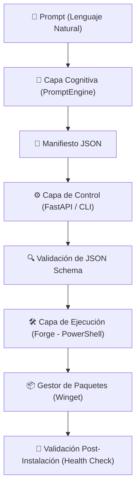

# Lumi Architect (AI Infrastructure Forge)

## 1. Visión General y Misión Crítica
**Lumi Architect** es un sistema experto de orquestación de entornos de desarrollo asistido por Inteligencia Artificial. Su misión crítica es eliminar el trabajo manual, repetitivo y propenso a errores que conlleva el aprovisionamiento de entornos de desarrollo en Windows. El usuario ingresa un comando en lenguaje natural (ej. *"Configura un entorno MERN"* o *"Instala herramientas para Data Science"*), y el "Cerebro" del sistema deduce e infiere todas las dependencias necesarias. A partir de ello, genera un *Manifest* JSON estructurado que es validado e instalado silenciosamente utilizando el gestor de paquetes oficial de Windows (`winget`), asegurando instalaciones atómicas y limpias.

## 2. Arquitectura del Sistema y Flujo de Datos
El proyecto aplica una arquitectura **Neural-to-Script Pipeline**, dividida en capas funcionales independientes: Cognición (LLM), Control (API/CLI) y Ejecución (Forge).



**Explicación del Flujo:**
1. El usuario interactúa a través de la CLI interactiva (`rich`) o la interfaz web React.
2. El string de lenguaje natural es enviado a la capa cognitiva (`Brain`), la cual consulta a un LLM configurado.
3. El LLM responde devolviendo un Manifiesto en formato JSON validado según `architecture_manifest.schema.json`.
4. El Manifiesto es transferido al `Forge` (scripts en PowerShell), que interroga al sistema para verificar qué software ya está instalado (Idempotencia).
5. Se ejecutan instalaciones silenciosas usando `winget install --silent --exact`.
6. Por último, `health_check.ps1` valida la disponibilidad de los ejecutables en el `PATH` de Windows.

## 3. Stack Tecnológico y Decisiones de Ingeniería
- **Motor Cognitivo y Backend API:** Python 3.11+ junto a FastAPI. Python es el estándar unificador para interactuar con APIs de lenguaje, mientras que FastAPI maneja solicitudes concurrentes mediante ASGI (`uvicorn`).
- **Interactividad CLI:** Librería `rich`. Añade retroalimentación de estado de alta calidad visual en la consola, como barras de progreso y renderizado condicional de tablas sin requerir frameworks pesados TUI.
- **Frontend Interfaz Web:** React 19 + Vite (`lumi-ui/`). Estilo visual Glassmorphism para exponer el orquestador a usuarios que prefieren dashboards web sobre consolas.
- **Ejecución Nativa:** PowerShell 7 + Winget. Winget es la fuente de verdad oficial de Microsoft para repositorios de software, asegurando que los paquetes instalados están firmados y libres de malware, superando a gestores de terceros como Chocolatey.

## 4. Componentes Clave y Análisis de Código
- `Lumi-Architect/brain/prompt_engine.py`: Encapsula la lógica de interacción con el LLM. Utiliza un system prompt fuertemente restringido instruyendo al LLM a que genere únicamente código JSON compatible con la especificación de infraestructura y sin comentarios adicionales.
- `Lumi-Architect/schemas/architecture_manifest.schema.json`: El contrato de la aplicación. Cualquier salida del cerebro que no cumpla este esquema es rechazada, previniendo inyecciones de código o errores de ejecución.
- `Lumi-Architect/forge/executor.ps1`: Motor de ejecución en PowerShell. Analiza el JSON, comprueba la existencia de cada `package_id` y delega la descarga/instalación a Winget evitando reinstalaciones.
- `Lumi-Architect/main.py`: Punto de entrada de la CLI, manejando el *event-loop* interactivo de presentación (preguntas al usuario, carga visual, impresión del recibo final).

## 5. Mapeo Teórico-Académico (Fundamentos de Ciencias de la Computación)
- **Compiladores y Autómatas (Validación Semántica):** Uso de Esquemas JSON como gramática formal libre de contexto para validar la salida (AST implícito) de la fase léxica generada por el LLM.
- **Sistemas Operativos e Infraestructura Inmutable:** Aplicación del principio de **Idempotencia**. Independientemente de la cantidad de veces que se ejecute el orquestador sobre un entorno, el estado final del sistema será idéntico al descripto en el Manifiesto.
- **Teoría de Agentes Reactivos:** El `PromptEngine` actúa como un agente de inferencia lógica de primer orden, mapeando una semántica informal (lenguaje humano) a reglas deterministas de máquina.

## 6. Guía de Despliegue y Configuración
### Requisitos Previos
- Windows 10/11 con `winget` habilitado (por defecto en builds modernos).
- Python 3.11+.
- Node.js v18+ (Solo para el dashboard web).

### Configuración del Entorno
Ejecutar el instalador automático de dependencias. Instalará bibliotecas de Python, configurará el entorno virtual y validará Winget:
```powershell
cd "c:\PROYECTOS ESTABLES\Lumi-Architct"
powershell -ExecutionPolicy Bypass -File setup_dependencies.ps1
```

### Ejecución
**Modo CLI Interactivo (Sugerido para SysAdmins):**
```powershell
run.bat
# Si no, de forma explícita: .venv\Scripts\python.exe Lumi-Architect\main.py --demo
```

**Modo Servidor Web / Dashboard:**
En la Terminal 1 (Levanta el Backend):
```powershell
.venv\Scripts\python.exe -m uvicorn Lumi-Architect.api:app --reload --port 8000
```
En la Terminal 2 (Levanta el Frontend UI):
```powershell
cd lumi-ui
npm run dev
```
